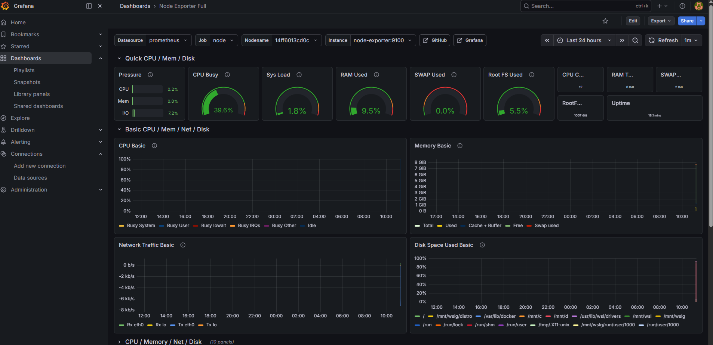
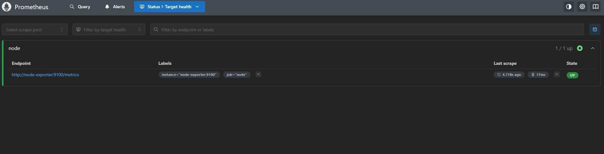

# SRE Monitoring Stack

Monitoring stack built with Docker, Prometheus, Grafana and Node Exporter.

## Project Overview

This project demonstrates how modern infrastructure monitoring works using an observability stack.

The system collects Linux metrics, stores them in Prometheus and visualizes them in Grafana dashboards.

## Architecture

Linux Host  
│  
Node Exporter  
│  
Prometheus  
│  
Grafana  

## Technologies

- Docker
- Prometheus
- Grafana
- Node Exporter
- Linux

## Features

- Containerized monitoring stack
- Linux system metrics collection
- Prometheus time-series monitoring
- Grafana visualization dashboards
- CPU, Memory, Disk and Network monitoring
- Basic alert rules

## Metrics Monitored

- CPU Usage
- Memory Usage
- Disk Usage
- Network Traffic
- System Load
- Uptime

## Screenshots

### Grafana Dashboard

### Prometheus Targets

## How to Run

Clone repository:
git clone https://github.com/elkoii/sre-monitoring-stack

Start services:

docker-compose up -d

Access dashboards:

Grafana  
http://localhost:3000  

Prometheus  
http://localhost:9090  

## Learning Goals

This project demonstrates practical skills in:

- Infrastructure monitoring
- Observability
- Docker containers
- Prometheus metrics collection
- Grafana dashboards
- Linux system metrics
